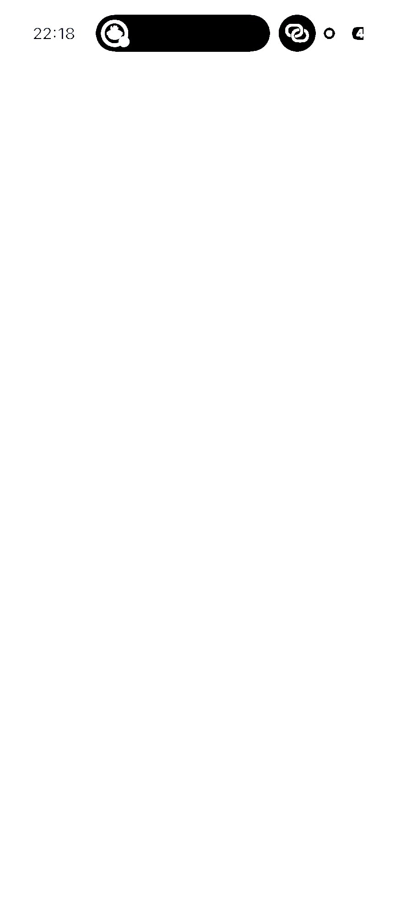
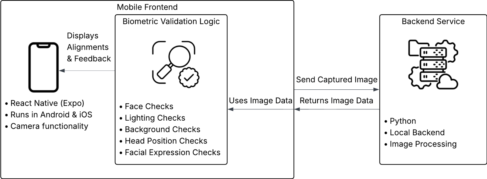
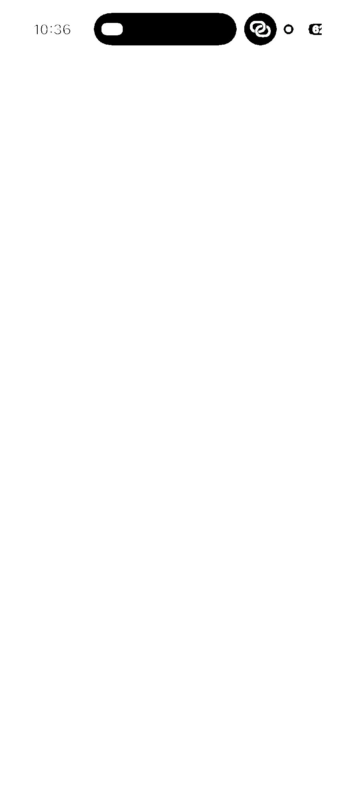
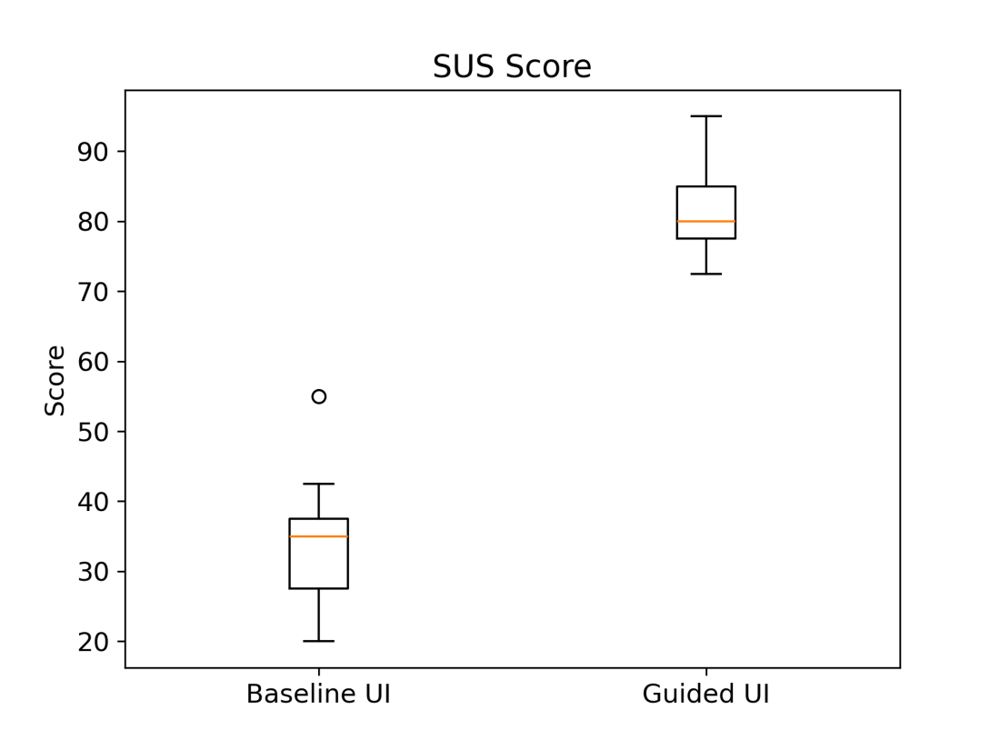
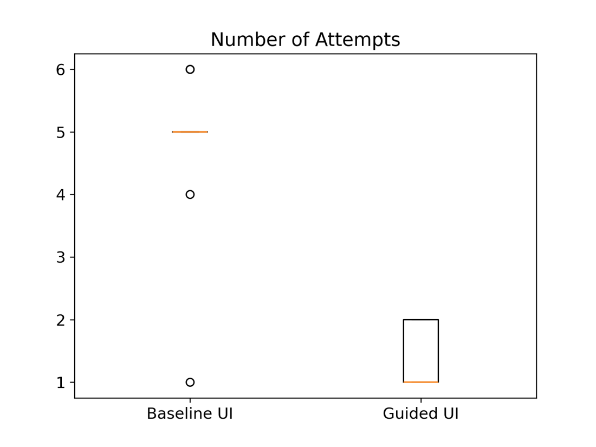
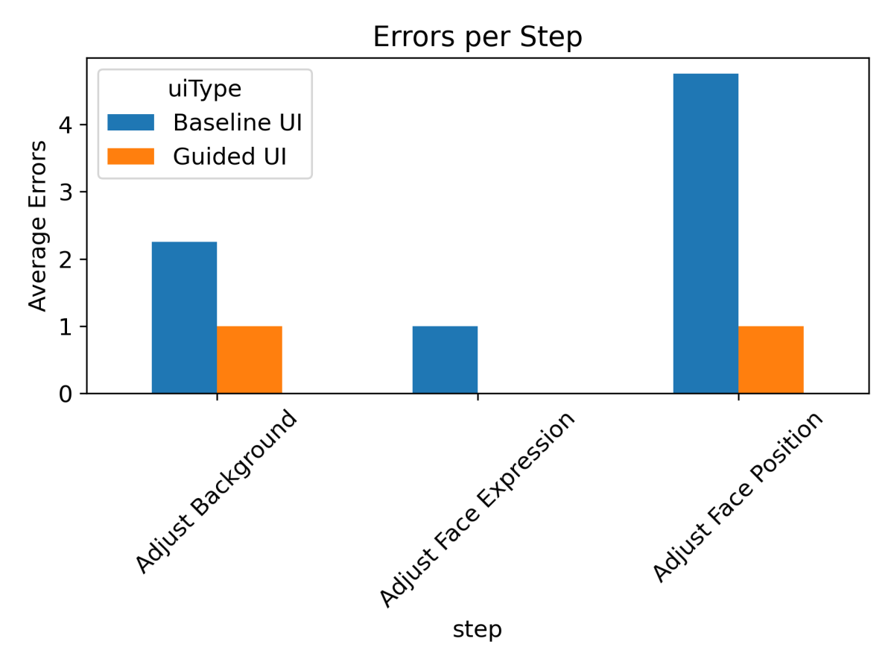
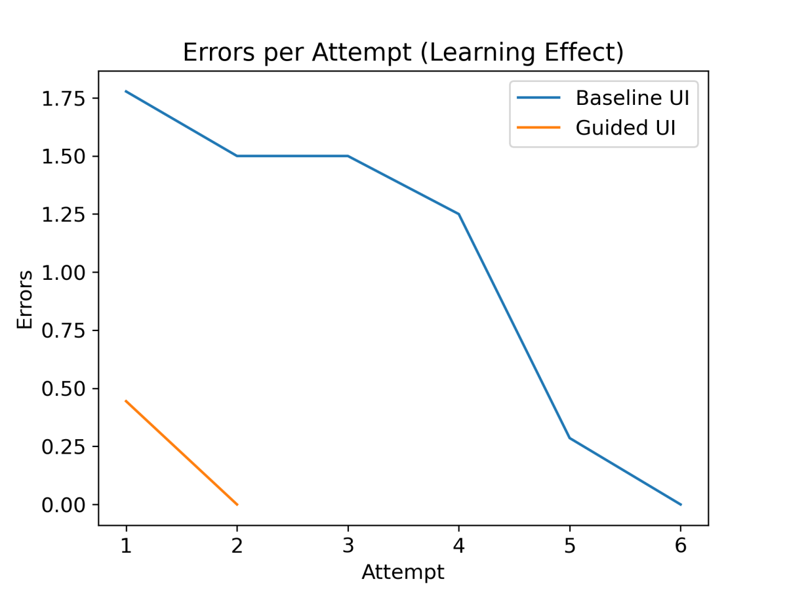

# Guided Capture for ICAO-Compliant Passport Photos

**Does real-time, step-by-step guidance help people take a compliant passport photo on their own phone?**

A Bachelor's thesis project (UAS Technikum Wien, BSc Computer Science) built to answer that question empirically: a React Native app with two deliberately different camera UIs, a FastAPI + MediaPipe service that scores each frame against ICAO photo rules, and a controlled within-subjects user study with statistical analysis.

The guided UI raised usability from **34.4 to 81.9 SUS** (*d* = 5.53) and cut retakes from **4.7 to 1.3 attempts** per participant.

| Baseline UI | Guided UI |
|---|---|
|  |  |
| A plain camera. Shutter, flash, flip — no feedback until the photo is reviewed. | Step tracker, alignment oval and one live instruction at a time. |

---

## Contents

- [What the system does](#what-the-system-does)
- [Architecture](#architecture)
- [The two conditions](#the-two-conditions)
- [Compliance pipeline](#compliance-pipeline)
- [Study design](#study-design)
- [Results](#results)
- [Repository layout](#repository-layout)
- [Running it](#running-it)
- [Thesis](#thesis)
- [Engineering notes](#engineering-notes)

---

## What the system does

Passport photos get rejected for reasons that are invisible while you're taking them: the background is too textured, the face is too small in frame, the head is tilted, the mouth is open. The usual mobile camera tells you none of this until an official does.

This system checks each frame as it is captured and surfaces **one actionable instruction at a time** — "Position your face inside the oval", "Move to a brighter spot" — walking the user through five compliance stages before the shutter is allowed to matter.

The research question is not whether the checks work, but whether *presenting* them as live guidance changes user performance. So the same detection backend drives both UIs; only the presentation differs.

## Architecture



```
expo-camera frame (base64)
        │
        ▼
util/FaceDedection.js ──── POST /detect ────► FastAPI + MediaPipe FaceMesh
        │                                              │
        │        ◄──── landmarks, bbox, brightness, ───┘
        │              background flag, yaw/roll,
        │              eye + mouth openness
        ▼
util/AdaptFaceDedectionMetrics.js   normalize to app-side shape
        ▼
util/ComplianceCheck.js             metrics + current step → verdict
        ▼
constants/StepInformations.js       verdict → user-facing hint
        ▼
Baseline or Guided overlay          render (or withhold) the hint
```

The split matters: detection is stateless and lives on the server, while *which* rule applies right now is client-side step state. That is what makes a single backend able to serve two different UX conditions without branching on condition anywhere in the detection code.

## The two conditions

Both variants use identical detection, identical thresholds and identical capture code. They differ only in what the user is told and when.

| | Baseline | Guided |
|---|---|---|
| Feedback timing | After capture, on the review screen | Live, per frame |
| Instructions | None | One at a time, current step only |
| Framing aid | None | Oval + corner brackets |
| Progress | None | 5-stage step tracker with locks |
| Retry loop | Retake blind | Retake with the failing rule named |

| Baseline — rejected | Guided — problem surfaced live |
|---|---|
|  |  |

Keeping the two behaviourally symmetrical apart from the manipulated variable is an internal-validity requirement, not a style choice — it is why `screens/baselineUIScreens/` and `screens/optimizedUIScreens/` are separate trees rather than one component with an `if (guided)` branch.

## Compliance pipeline

`server.py` derives, per frame:

| Metric | Method |
|---|---|
| Face count + bounding box | MediaPipe FaceMesh landmarks, clamped to normalized coords |
| Overall / face / background brightness | Mean grayscale intensity, Gaussian-blurred to suppress sensor noise |
| Background suitability | 7 patches sampled away from the face; thresholds on brightness, saturation, inter-patch variance and texture (std) |
| Head pose (yaw, roll) | Nose offset from eye midpoint; inter-eye vertical delta |
| Eye openness | Vertical distance between upper/lower lid landmarks |
| Mouth openness | Vertical distance between inner lip landmarks |

The client maps these onto five ordered stages — `FIND_FACE → ADJUST_LIGHTNING → ADJUST_BACKGROUND → ADJUST_FACE_POSITION → ADJUST_FACE_EXPRESSION` → capture — and shows the hint for the current stage only.

The background heuristics are threshold-based rather than learned. For a study instrument run under controlled conditions that is a deliberate trade: thresholds are inspectable and explainable to participants and examiners, where a model's failures would not be. It is also the pipeline's main limitation — see [Engineering notes](#engineering-notes).

## Study design

- **Design:** within-subjects, both conditions per participant
- **N:** 9 participants × 2 conditions = 18 task runs
- **Counterbalancing:** `StorageService.getNextUITypeSmart` assigns whichever condition has been run less often, breaking ties at random — keeping the two groups balanced as the study runs rather than fixing an order in advance
- **Task:** capture one ICAO-compliant passport photo
- **Instruments:** SUS (10 items) + 5 custom Likert items + free-text feedback
- **Logged automatically:** task time, attempts, per-step errors/warnings, first-attempt compliance, full attempt history
- **Ethics:** informed consent collected in-app before any data capture ([screen](docs/images/informed-consent.jpg)); data is pseudonymous (participant ID only)

Measures are instrumented in the app rather than observed by hand, so timing and error counts don't depend on the observer.

## Results

Effects are large and consistent across both self-reported and behavioural measures.

| Measure | Baseline | Guided | Test | p | Effect |
|---|---|---|---|---|---|
| SUS score | 34.4 | 81.9 | t-test | 2.9 × 10⁻⁹ | *d* = 5.53 |
| Custom Likert (1–5) | 2.00 | 4.22 | t-test | 5.6 × 10⁻⁹ | *d* = 5.28 |
| Attempts | 4.67 | 1.33 | Mann–Whitney | 0.0017 | *r* = 0.72 |
| Errors | 6.33 | 0.44 | Mann–Whitney | 0.0019 | *r* = 0.72 |
| Errors per attempt | 1.24 | 0.22 | Mann–Whitney | 0.0023 | *r* = 0.71 |
| Step success rate | 65.6 % | 88.9 % | Mann–Whitney | 0.0007 | *r* = 0.80 |
| First-attempt compliance | 11.1 % | 66.7 % | Fisher's exact | 0.0498 | OR = 16.0 |
| Task time | 65.6 s | 57.8 s | Mann–Whitney | 0.43 | *r* = 0.20 (n.s.) |

<p align="center">
  
  
</p>

**Task time is the interesting null.** Guided users were not significantly faster, but got compliant photos in a third of the attempts. Live guidance front-loads effort into the first attempt — reading and acting on hints costs time that blind retries spend re-shooting. Users trade the same minute for a much better outcome, rather than saving time.

Errors concentrate where guidance is most informative: differences are significant for *Adjust Face Position* (p = 0.014) but not *Adjust Background* (p = 0.30) — background is a property of the room the user often cannot fix by moving, so telling them about it helps less.

<p align="center">
  
  
</p>

With N = 9 these effect sizes are certainly inflated relative to what a larger sample would show, and a *d* above 5 should be read as "the conditions barely overlap on this measure", not as a precise estimate. The direction and consistency across independent measures are the durable findings; the magnitudes are not.

## Repository layout

```
app/                    Expo / React Native study client
  screens/              one screen per study step, split by condition
  components/           Camera/, compliance/, OptimizedUI/, Questionnaire/
  navigation/           AppNavigator.js — the study flow, single source of truth
  store/                StudyResultsContext + AsyncStorage wrapper
  util/                 detection glue, compliance rules, CSV/JSON export
  constants/ models/    static copy and hint catalog vs. class shapes

backend/                FastAPI service + offline analysis
  server.py             POST /detect — MediaPipe pipeline
  analysis.py           descriptives, inferential tests, effect sizes
  plots.py              figure generation
  ParticipantsData/     raw study export (pipeline input)
  analysis/ figures/    derived tables and plots

thesis/                 the paper (PDF) and qualitative coding
docs/images/            screenshots, architecture, result figures
```

The app and backend have no shared build — they are separate toolchains (npm and pip) that happen to live in one repository, and each is run independently.

A note on naming: the code calls the guided condition `optimized`, while the thesis and the exported data call it `guided`. The data format was fixed once the study ran, so the code kept its original term rather than invalidating the recorded results.

## Running it

**Backend**

```bash
cd backend
python -m venv venv && source venv/Scripts/activate   # Windows bash; use bin/activate on macOS/Linux
pip install -r requirements.txt
uvicorn server:app --host 0.0.0.0 --port 8000 --reload
```

Bind to `0.0.0.0` — a phone cannot reach `localhost` on your machine.

**App**

```bash
cd app
npm install
EXPO_PUBLIC_BACKEND_URL=http://<your-LAN-IP>:8000 npm start
```

Scan the QR code with Expo Go. The phone and the host must be on the same network. Without a backend, swap `util/FaceDetectionMock.js` into `FaceDedection.js` to run the full flow on canned metrics.

**Reproducing the analysis**

```bash
cd backend
python analysis.py    # ParticipantsData/ → analysis/ (CSV + JSON)
python plots.py       # analysis/ → figures/
```

`analysis.py` must run before `plots.py`; plots read the derived tables, not the raw export. Both are deterministic: re-running them on the committed `ParticipantsData/` reproduces every committed number in `analysis/` exactly.

## Thesis

**[Improving Task Efficiency in Mobile Passport Applications through Guided UI Design](thesis/Improving-Task-Efficiency-in-Mobile-Passport-Applications-through-Guided-UI-Design.pdf)** (PDF, 52 pp.) — the full write-up: background, related work, method, results and discussion.

Submitted in fulfillment of the requirements for the degree of Bachelor of Science in Engineering at the University of Applied Sciences Technikum Wien, May 2026. Supervisor: Christian Lagelstorfer, BSc MSc.

- [Qualitative coding of free-text feedback](thesis/qualitative_analysis.xlsx) — the open-response items, coded into themes

Participant data in `backend/ParticipantsData/` is pseudonymous (`P01`–`P09`); no identifying information was retained. All participants gave informed consent before capture, and the study complies with the GDPR — see §3.5 of the thesis.

## Engineering notes

Things I would change, and why they are the way they are:

- **Threshold-based background checks.** Hand-tuned cutoffs on brightness, saturation, variance and texture. They are transparent and were stable across the study room, but they are the component most likely to misfire in an unseen environment — a bright patterned wall can pass, an evenly lit dark one fails. A learned segmentation model is the obvious upgrade and the obvious loss of explainability.
- **Per-frame round-trip.** Every analysed frame is base64-encoded and sent over the LAN. Fine for a controlled study, wrong for production: it needs on-device inference (MediaPipe ships for mobile) both for latency and because faces should not leave the phone.
- **Yaw/roll from three landmarks.** A cheap proxy, not real pose estimation — it degrades at larger angles where a PnP solve over the full landmark set would hold up.
- **Requests are stateless and unauthenticated.** Correct for a LAN-local study instrument, unacceptable for anything deployed.
- **No automated tests.** The honest gap. The compliance rules in `ComplianceCheck.js` are pure functions over a metrics object — they are the part that most deserves unit tests and the part I would write first.

---

**Matthias Fichtinger** · BSc Computer Science, UAS Technikum Wien · 2026

Released under the [MIT License](LICENSE). The thesis text in `thesis/` is © the author, all rights reserved.
